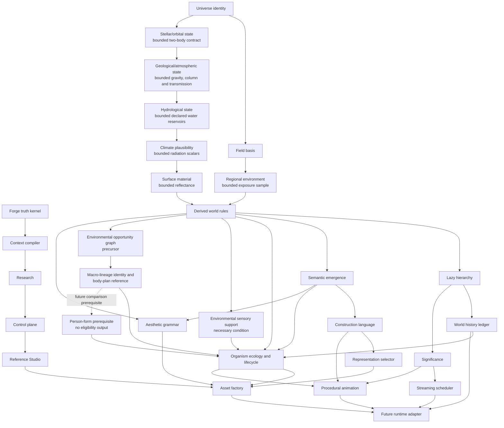

# Canonical Dependency Map

## Bottom-up rule

The Forge foundation and game-canonical foundation are separate tracks that
meet in the Reference Studio. No runtime engine is selected or created until
the runtime adapter's dependencies are reference-proven.

## Cross-cutting rules

- `forge-truth-kernel` is the provenance and authority boundary for all work.
- `forge-reference-studio` must show every promoted canonical output with its
  seed, recipe, evidence, test run, cost, and version.
- `significance-system` is shared; no subsystem owns an incompatible private
  LOD or update-priority model.
- Cached data is disposable. Addresses, recipes, versions, and explicit deltas
  are canonical.
- World generation is causal: physical conditions precede ecology, senses,
  aesthetics, construction and representation.
- Categorical physical regions or biome identities may index and explain
  evidence but cannot create automatic palette, material or ecology seams.
  Continuous causal fields produce deterministic ecotones; sharp presentation
  boundaries require sharp physical causes and must not be blurred away.
- Environmental support never implies organism capability; opportunity graphs
  never imply body-part topology; explicit macro-lineage and body-plan identity
  precede sensory physiology and comparative person-form evaluation.
- Organism age, lineage and gameplay identity remain canonical across fidelity
  tiers; presentation may simplify but may not fork truth.
- Natural and aesthetic mechanisms are scoped candidates governed by P16, not
  universal solvers.
# G1 product dependency correction (2026-07-18)

`C2 -> C3A -> C4 -> GP4`, while `C3A -> C3B (evidence blocked)` is a separate physical/presentation lane. GP0 depends on C3A; GP1 -> GP2 -> GP3 -> GP4 then supply the product vertical. C4 imports only the validated `WorldGenerationInput`, replayed `CausalWorldPacket` v1 and `validate_world_packet` seam; it does not depend on the C3B physical/optical chain.
