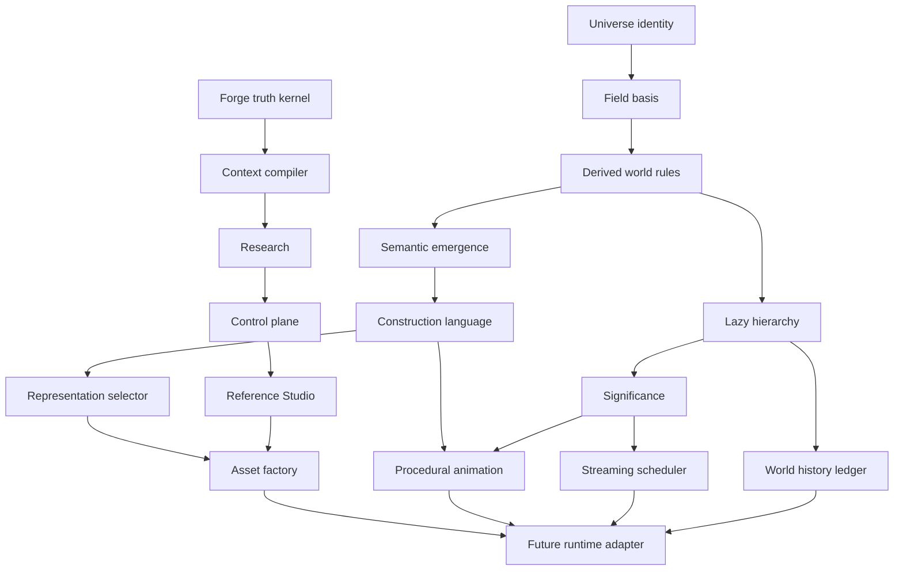

# Canonical Dependency Map

## Bottom-up rule

The Forge foundation and game-canonical foundation are separate tracks that
meet in the Reference Studio. No runtime engine is selected or created until
the runtime adapter's dependencies are reference-proven.

## Cross-cutting rules

- `forge-truth-kernel` is the provenance and authority boundary for all work.
- `forge-reference-studio` must show every promoted canonical output with its
  seed, recipe, evidence, test run, cost, and version.
- `significance-system` is shared; no subsystem owns an incompatible private
  LOD or update-priority model.
- Cached data is disposable. Addresses, recipes, versions, and explicit deltas
  are canonical.
