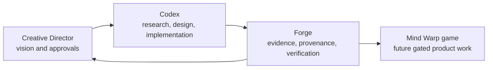

# Mind Warp Project Atlas

Mind Warp has two connected horizons: Forge is the active foundation; the
Mind Warp game is the destination. Forge exists so a solo creative director
can work continuously with Codex without losing project truth, workflow, or
reasoning at context boundaries.

Read `ROADMAP.md` for sequence, `FLOW.md` for operating method, and
`project-model.json` for canonical IDs and references.
