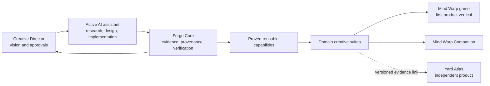

# Mind Warp Project Atlas

Mind Warp is a product-driven portfolio. Forge Core preserves project truth and
builds proven reusable capabilities; domain creative suites assemble those
capabilities for isolated product shells. Mind Warp game is the first demanding
customer, followed by the Companion. Yard Atlas remains independent and
evidence-linked.

Read `ROADMAP.md` for sequence, `FLOW.md` for operating method, and
`project-model.json` for canonical IDs and references.
