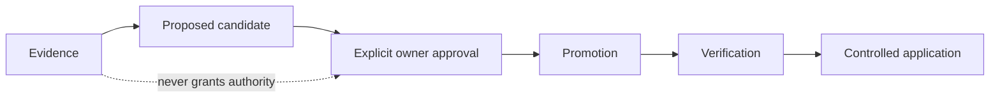

# Forge Operating Flow

Every work package follows: research → design → adversarial review → readiness
gate → authorized implementation → verification → promotion. Captured text,
assistant output, and summaries remain evidence; they are never authority.
