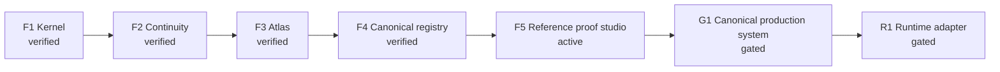

# Mind Warp Roadmap

The current active milestone is **F5: Engine-neutral proof harnesses and
Reference Studio**. ProofReceipt P1, bounded universe-identity P2, bounded
field-basis P3, capability-free hierarchy/history P4, and bounded
significance/scheduler P5 reference prototypes are verified. P5 keeps shared
significance separate from consumer fidelity, admits safety work before
dispatch, recomputes bounded dependency priority donation, separates fairness
debt from importance, settles cancellation, and quarantines stale output. The
P6 semantic/construction is verified as a bounded capability-free reference.
It separates canonical concept IDs from labels, causal proof from structural
graphs, feasibility from trade comparison, deterministic validation from
proposal generation, and P6 recipes from P7 representation. P7 reconciliation
and design splits a capability-free P7a contract/lineage harness from a
separately gated P7b perception atlas. P7a is verified with strict decisions,
lineage, hostile-reference, repair, material/articulation-plan, temporal-map,
and read-only receipt proofs. P7b controlled-perception design is researched
and its P7b-0 capability-free protocol/receipt validator is verified with 18
adversarial tests and read-only integration. The owner-approved built-in Forge
reference viewport now projects one strict data-only fixture into deterministic
front, side, and top wireframes with two pose frames and seven adversarial
tests. It launches no external renderer or program. Structured stimulus and
owner-observation binding is next. External executable containment remains an
R1 concern only if a selected adapter actually needs untrusted executable
content. Runtime executors, product vocabulary and weights, AI generation,
general geometry/assets/animation, multiplayer, and mutable gameplay
implementation remain outside authority.

No Unity, Godot, or custom runtime project is created or modified until the
final runtime-adapter decision is explicitly authorized.
