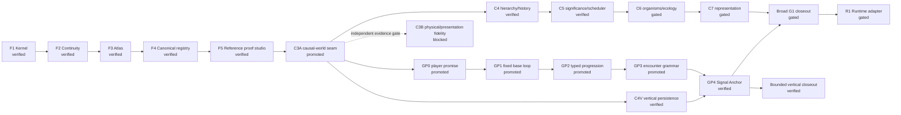

# Mind Warp Roadmap

The current active milestone is **G1: Canonical production system**. GP1 is
structurally complete, GP2 typed progression is promoted after its registered
full-gate proof, and C4V is recorded after registered gate
`run-fa6334a300e04d409dd5cddb4f22542e`, closed with no C4V work remaining
active. Owner-authorized GP3 is promoted and
closed after registered gate `run-50a8c78043eb46c483f1f655d3793f9b`. GP4 is verified after registered gate `run-7e5c44dc8f48424a8cec42da756e3127`, and its exact typed bounded vertical-closeout receipt is complete immutable evidence. The owner retained the broad G1-first route: C4 and the capability-free C5 reference are verified; C5 remains the waiting cursor while C6 stays separately proposed and gated, followed by gated C7, broad G1-CLOSEOUT and then R1. C3A exposes the exact validated causal-world seam needed downstream;
C3B remains visibly blocked and does not prevent the first fixed-content
vertical. Runtime selection remains at R1. The F5 engine-neutral proof
milestone is verified. ProofReceipt P1, bounded
universe-identity P2, bounded
field-basis P3, capability-free hierarchy/history P4, and bounded
significance/scheduler P5 reference prototypes are verified. P5 keeps shared
significance separate from consumer fidelity, admits safety work before
dispatch, recomputes bounded dependency priority donation, separates fairness
debt from importance, settles cancellation, and quarantines stale output. The
P6 semantic/construction is verified as a bounded capability-free reference.
It separates canonical concept IDs from labels, causal proof from structural
graphs, feasibility from trade comparison, deterministic validation from
proposal generation, and P6 recipes from P7 representation. P7 reconciliation
and design splits a capability-free P7a contract/lineage harness from a
separately gated P7b perception atlas. P7a is verified with strict decisions,
lineage, hostile-reference, repair, material/articulation-plan, temporal-map,
and read-only receipt proofs. P7b controlled-perception design is researched
and its P7b-0 capability-free protocol/receipt validator is verified with 18
adversarial tests and read-only integration. The owner-approved built-in Forge
reference viewport now projects one strict data-only fixture into deterministic
front, side, and top wireframes with two pose frames and seven adversarial
tests. It launches no external renderer or program. H1-H7 now culminate in a
separately owner-promoted engine-neutral humanoid proof baseline with no asset,
runtime, or production claim. G1 entry starts by reconciling the inherited C1
ProofReceipt storage gate with the already verified F5 decision and by requiring
exact typed H7 dependency checks rather than generic promoted state. External
executable containment remains an
R1 concern only if a selected adapter actually needs untrusted executable
content. Runtime executors, product vocabulary and weights, AI generation,
general geometry/assets/animation, multiplayer, and mutable gameplay
implementation remain outside authority.

No Unity, Godot, or custom runtime project is created or modified until the
final runtime-adapter decision is explicitly authorized.
